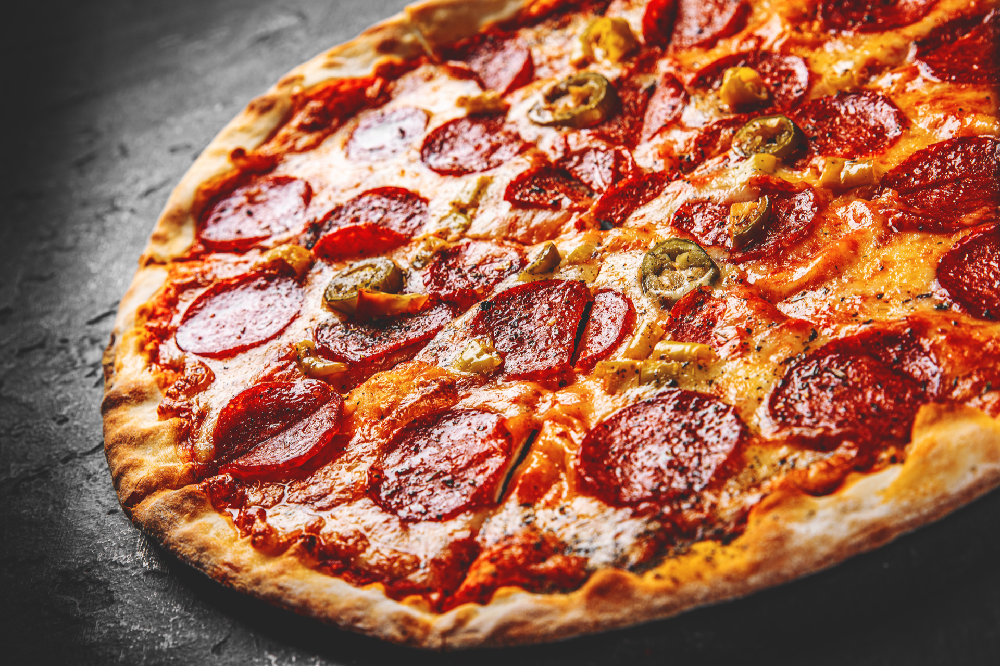
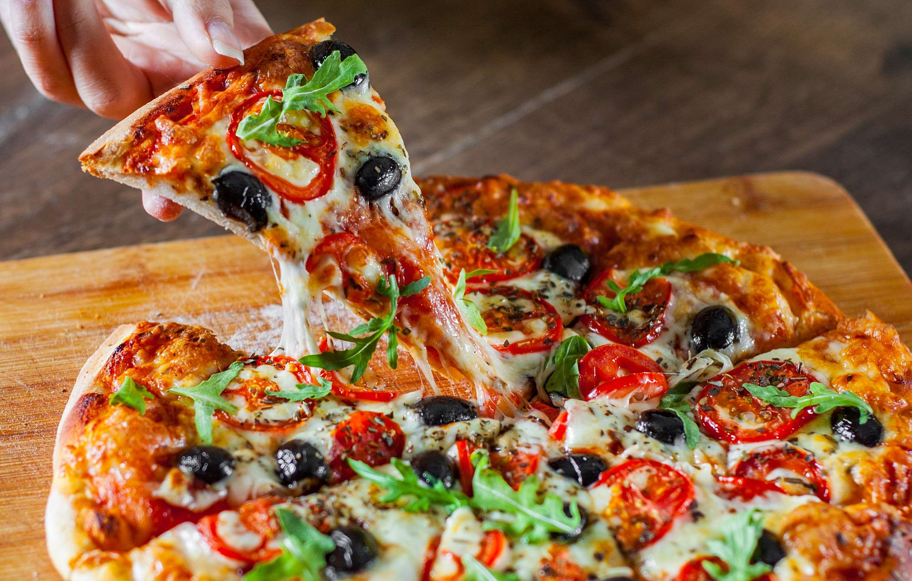

Menu Pizzerii 
"Pizzeria Bella Napoli"

Przystawki:

Bruschetta - 15 zł

Carpaccio z wołowiny - 25 zł
Sałatka caprese - 18 zł

Dania główne:
Pizza Margherita - 28 zł
Pizza Vegetariana - 32 zł
Pizza Quattro Formaggi - 35 zł

Pizza Verdura - 34 zł (sos pomidorowy, mozzarella, pieczarki, papryka, cebula, pomidory, czarne oliwki, oregano)

Desery:
Tiramisu - 18 zł
Panna cotta z owocami - 20 zł
Sernik z borówkami - 22 zł

Napoje:
Coca-Cola - 8 zł
Wino czerwone (lampka) - 15 zł
Sok pomarańczowy - 10 zł
